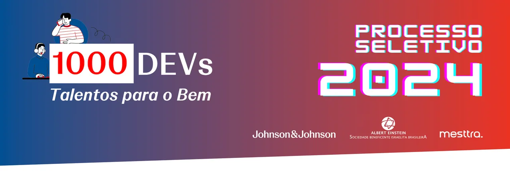

# Gerenciador de Vacinas - Hackathon 2025 1000devs

Um sistema para gerenciar as vacinas aplicadas aos integrantes de uma família, permitindo o cadastro de pacientes, registro de imunizações, consulta do calendário vacinal por idade recomendada e geração de estatísticas.

---

## 🎯 Objetivo

Desenvolver um software que permita o gerenciamento das vacinas aplicadas aos integrantes de uma família. O sistema deve:
- Facilitar o cadastro de pacientes e vacinas.
- Registrar as imunizações aplicadas.
- Permitir a consulta do calendário vacinal por idade recomendada.
- Gerar estatísticas sobre vacinas aplicadas, atrasadas e próximas doses.

---

## 🛠️ Tecnologias Utilizadas

- **Java**: Linguagem de programação principal.
- **Spark**: Framework para criar APIs RESTful.
- **MySQL**: Banco de dados para persistência dos dados.
- **Maven**: Gerenciador de dependências.

---

## 🚀 Funcionalidades Principais

- **Cadastro de Pacientes**: Adicionar, alterar, excluir e consultar pacientes.
- **Registro de Imunizações**: Registrar vacinas aplicadas, com detalhes como data, dose, fabricante e local.
- **Consulta de Calendário Vacinal**: Visualizar vacinas recomendadas por faixa etária.
- **Estatísticas**: Obter informações sobre vacinas aplicadas, atrasadas e próximas doses.

---

## 👥 Equipe

Este projeto foi desenvolvido pelo **Grupo 6**, composto por:

- **Lucas Vinícius de Oliveira**
- **FulAna Carolina Silva**
- **Cicrano Eduardo Santos**
- **BeltranaLima**
- **Caboclo Almeida**
- **Sá Costa**

---

## 📜 Sobre o Programa

Este projeto foi desenvolvido durante o programa **1000Devs**, promovido pela **Mesttra** em parceria com a **Johnson & Johnson** e o **Hospital Israelita Albert Einstein**. O programa tem como objetivo capacitar desenvolvedores para criar soluções inovadoras na área da saúde.

---

